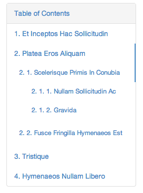

# TocJS

TocJS is a jQuery plugin for generating table of contents based on headings.



## Demo

* [Sample demo](https://rawgithub.com/nghuuphuoc/tocjs/master/demo/sample.html)
* [Style with Bootstrap](https://rawgithub.com/nghuuphuoc/tocjs/master/demo/style.html)
* [Scroll automatically](https://rawgithub.com/nghuuphuoc/tocjs/master/demo/scroll.html)
* [Number indexing](https://rawgithub.com/nghuuphuoc/tocjs/master/demo/number-indexing.html)
* [More indexing styles](https://rawgithub.com/nghuuphuoc/tocjs/master/demo/more-indexing.html)

## Features

* Allow to define different format for each heading level
* Generate anchor link for heading
* Automatically scroll to with the help of [Bootstrap ScrollSpy](http://getbootstrap.com/javascript/#scrollspy) plugin
* The table of contents are generated using nested ```ul``` elements
* Easy to customize look and feel

## Download

You can download TocJS from the [Github repository](https://github.com/nghuuphuoc/tocjs) directly or use [bower](http://bower.io):

```bash
$ bower install tocjs
```

## Usage

By default, TocJS generates a table of contents based on the headings (```h1``` to ```h6```) found on page.

In order to use this plugin:

* Insert ```toc.js``` to your page, ensure that it is placed after jQuery:

```html
<script type="text/javascript" src="path/to/jquery-1.10.2.min.js"></script>
<script type="text/javascript" src="path/to/toc.js"></script>
```

* Call the plugin when the document is ready:

```javascript
<script type="text/javascript">
$(document).ready(function() {
    $('element selector').toc();
});
</script>
```

The plugin provides the following options:

* ```selector``` (default value is _h1, h2, h3, h4, h5, h6_): Indicates which elements will be found and included in the table of contents
* ```elementClass``` (_toc_): The CSS class which will be added to root element
* ```rootUlClass``` (_toc-ul-root_): The CSS class which will be added to the root generated ```ul``` element
* ```ulClass``` (_toc-ul_): The CSS class which will be added to all generated ```ul``` elements (including the root and sub ones)
* ```prefixLinkClass``` (_toc-link-_): This option will be added as a prefix to CSS class of all generated ```a``` elements. The suffix is level of associating heading (1 to 6)
* ```heading``` (_null_): The _Table of Contents_ heading label placed at the top. This heading is not shown by default.
* ```indexingFormats``` (_{}_): Define the indexing formats for each heading level

```javascript
$(element).toc({
    indexingFormats: {
        <headingLevel>: '<formatter>'
    }
});
```

```<headingLevel>``` can be 'h1', 'h2', ..., 'h6'

```<formatter>``` is a string and can be:

Value               | Description
--------------------|------------
```number```        | The headings will be prefixed with number (1, 2, 3, ...)
```upperAlphabet``` | Prefix headings with uppercase alphabetical characters (A, B, C, ...)
```lowerAlphabet``` | Prefix headings with lowercase alphabetical characters (a, b, c, ...)
```upperRoman```    | Prefix headings with uppercase Roman numerals (I, II, III, ...)
```lowerRoman```    | Prefix headings with lowercase Roman numerals (i, ii, iii, ...)

You can define different formatter for each heading level, for example:

```javascript
$(element).toc({
    indexingFormats: {
        'h1': 'upperAlphabet',
        'h2': 'number',
        'h3': 'lowerAlphabet'
    }
});
```

If you want to set indexing formats for all levels:

```javascript
$(element).toc({
    indexingFormats: '<formatter>'
});
```

## Customize the look and feel

Assume that ```<div id="toc"></div>``` is the element containing the table of contents.
By default, TocJS generates the following markup:

```html
<div id="toc" class="toc">
    <ul class="toc-ul-root toc-ul">
        <li class="toc-heading"><a href="#">Table of Contents</a></li>

        <li><a href="#" class="toc-link-1">h1 heading</a></li>
        <li>
            <a href="#" class="toc-link-1">h1 heading</a>
            <ul class="toc-ul">
                <li><a href="#" class="toc-link-2">h2 heading</a></li>
                ...
            </ul>
        </li>
    </ul>
</div>
```

To customize the styles of table of contents, you can customize the ```toc```, ```toc-ul-root```, ```toc-ul```, ```toc-heading```, and ```toc-link-[1..6]``` classes.
Or create your own CSS classes and set them using the TocJS options which are described in the above section.

## Build

TocJS uses [grunt](http://gruntjs.com) for building process.
The process includes the following steps:

* Copy entire ```src/css``` and ```src/js``` directories to ```dist``` directory
* Compress the CSS files in ```src/css``` and save to ```dist/css```
* Compress the ```src/js/toc.js``` and save to ```dist/js/toc.min.js```

Grunt helps us simplify the process.

First, you have to install the dependencies defined in ```package.json``` (the following commands might need the administrator permission to run):

```
$ cd <TocJs_Directory>
$ npm install grunt --save-dev
$ npm install grunt-contrib-copy --save-dev
$ npm install grunt-contrib-cssmin --save-dev
$ npm install grunt-contrib-uglify --save-dev
```

Then, run the command below from the TocJS directory:

```
$ grunt
```

## Author

Nguyen Huu Phuoc ([Email](mailto: phuoc@huuphuoc.me) / [Twitter](http://twitter.com/nghuuphuoc) / [Github](http://github.com/nghuuphuoc))

## License

Copyright (c) 2013 Nguyen Huu Phuoc

TocJS is licensed under the MIT license.